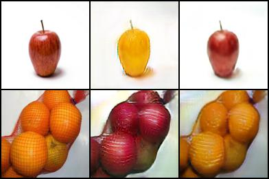

# cycle-consistency

## CycleGAN

### Samples

#### Orange to Apple and vice versa

The left column is original photos, the middle column is generated ones, while the right one is reconstruted ones.


You can also see the algorithm works like a style transfer. It won't change the shapes of objects.




### Dependencies

1. Pytorch 1.0+
2. Torchvision
3. Tensorboard

### Download data

```
./download_cyclegan_dataset.sh  monet2photo
```

### Train

I am using 128 as input size for a faster training speed. Feel free to try 256.

```
python train.py -d datasets/monet2photo/ -b 4 -j 4 -lr 0.0002 -li 1 -g resnet -i 128
```